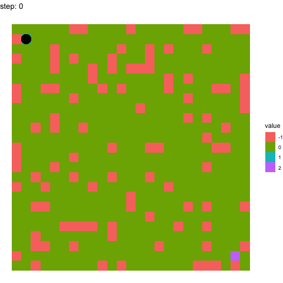

### Maze-Solver-With-Reinforcement-Learning
Using q-learning to make maze solving agents.

### Requirements
Python:
- numpy
- pandas
- random
- tqdm

R:
- tidyverse
- ggplot2
- reshape2
- glue
- gganimate
- gapminder

### Usage

One just has to run the q_learning.py file to generate the gifs for the maze solver. User can specify the following parameters by editing the hyperparameters section of q_learning.py:

- **num_episodes**: the number of times we will try to reach from start to goal, while learning the best move from each position.
- **episodes_and_next_10_to_plot**: Which timepoints to make the gif for. For each timepoint, the gif will be made visulializing the timepoint and the next 9 timepoints, for a better idea of learning arount that timepoint. Hence, ensure that you supply some value less than num_episodes - 9.
- **gamma**: coefficient of long term importance (it being more means that we give more importance to long term results than short term)
- **epsilon**: coefficient of exploration (it being more means that in each move in the maze, the agent with more likely just explore with a random action instead of choosing the best known action so far from there)
- **Maze** grid (or change the dimensions of the random grid)

### Example:

Learning at timepoint 100:

Learning at timepoint 990:

### References
- Adapted q-learning algo code from this youtube tutorial: https://youtu.be/qTY4Rr-x5q0?si=LbdH3lRjo3Otrk-s

